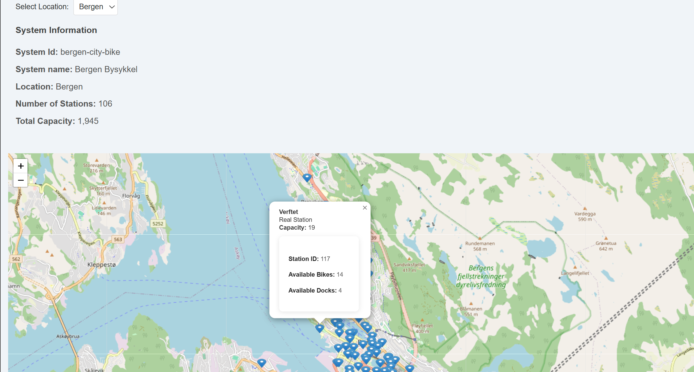

# Bike System Frontend

> **React + TypeScript** UI for the [Bike Station Service](https://github.com/Darius225/bike-system-backend). Displays real-time station data from multiple bike-sharing providers. Built with **Vite** for fast development and optimized builds.



## Quick Start

```bash
git clone https://github.com/Darius225/bike-system-frontend
cd bike-system-frontend
npm install
```

Create a `.env` file (not tracked by git):

```env
VITE_BACKEND_API_URL=http://localhost:3000
```

Start the dev server:

```bash
npm run dev
```

Open `http://localhost:5173`. Requires the [backend](https://github.com/Darius225/bike-system-backend) running at the configured URL.

## Project Structure

```
src/
├── components/       # React components (map, station details)
├── services/         # API client functions
└── main.tsx          # Entry point
```

## Testing

```bash
npm test
```

Tests exercise component rendering and API integration. The backend must be running for integration tests.

## Linting

```bash
npm run lint          # Check
npm run lint:fix      # Auto-fix
```

ESLint + Prettier enforce TypeScript standards.

## CI/CD

A GitHub Actions workflow (`.github/workflows/short-ci.yml`) runs linting and tests on every push/PR to `main`.


MIT — see [LICENSE](LICENSE).
